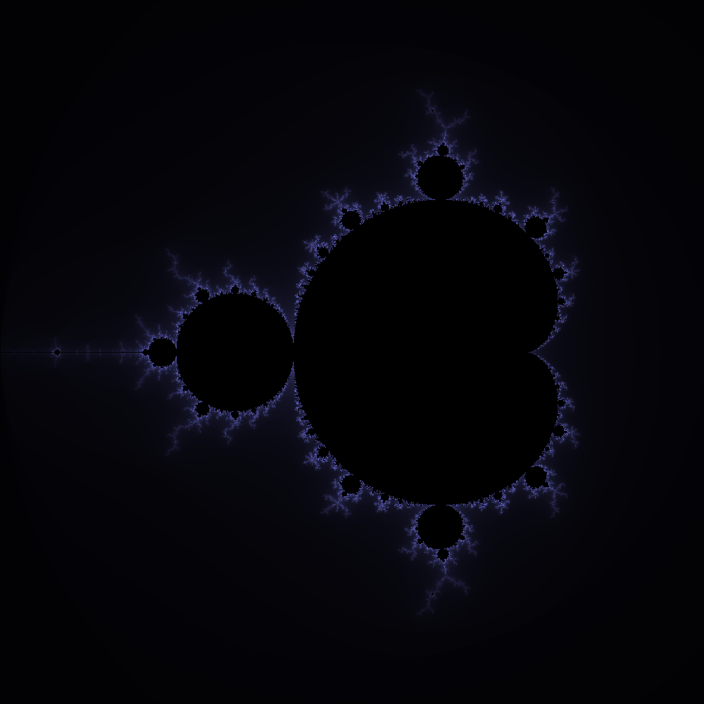
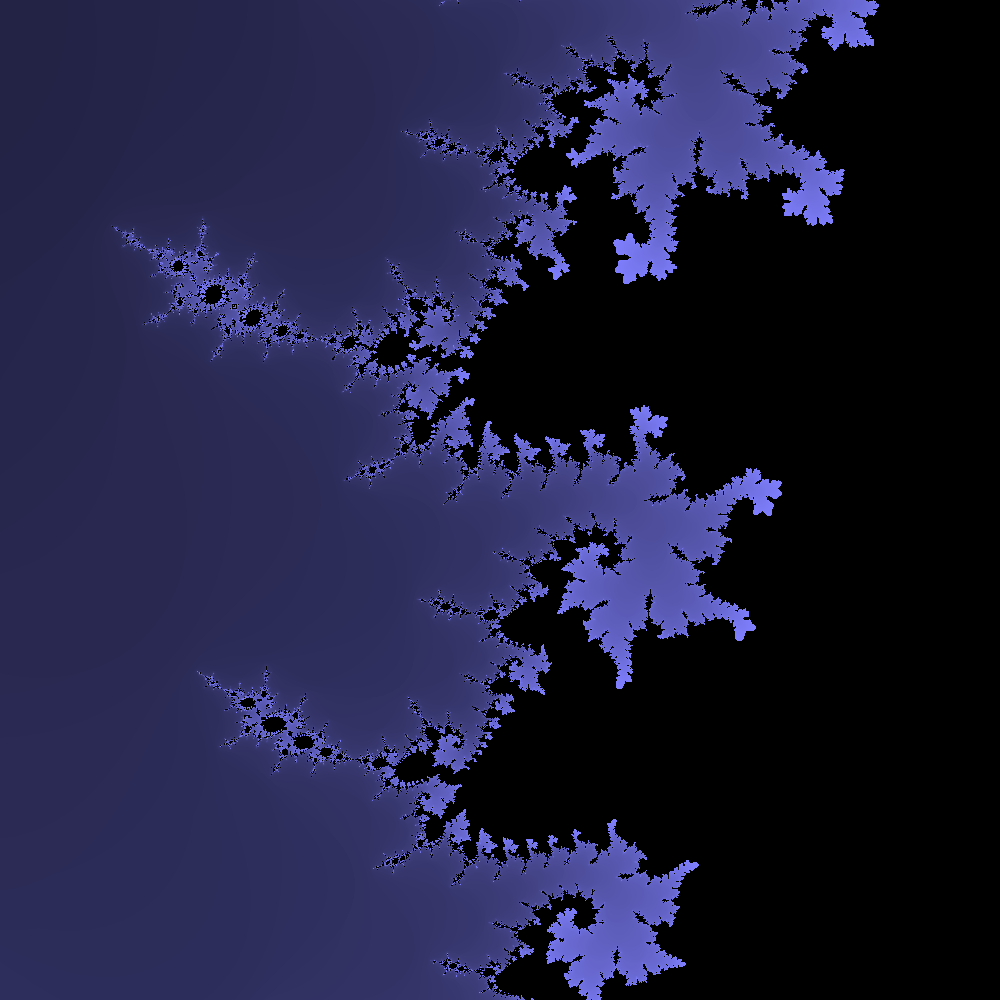
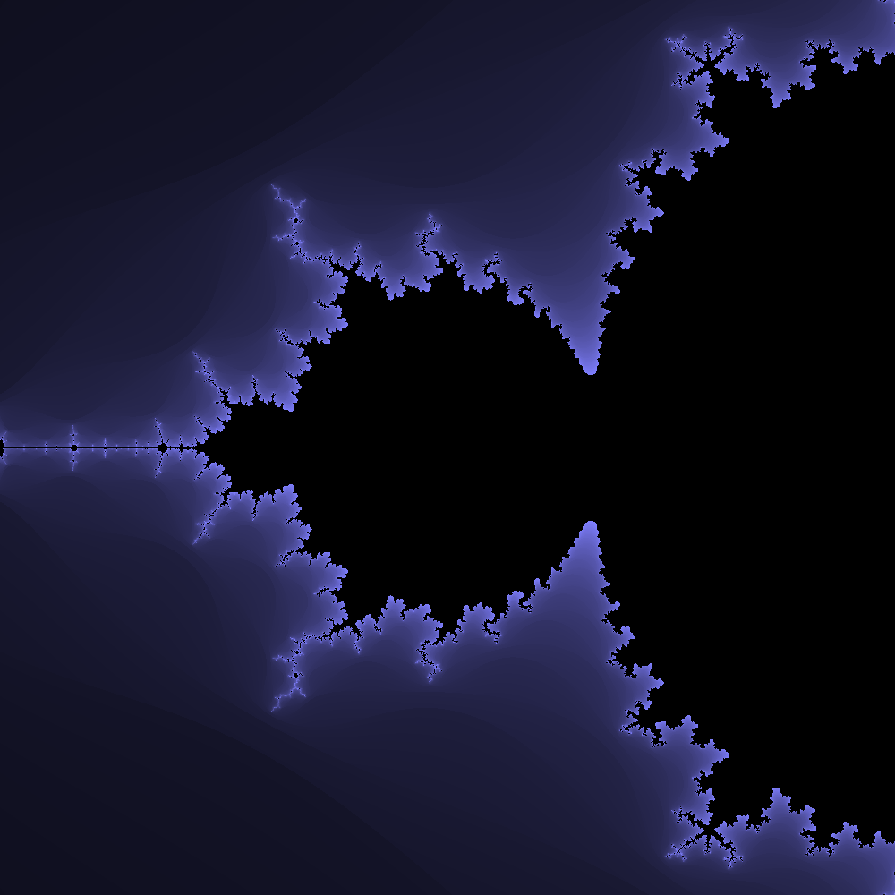

## Mandelbrot set

This console app can be used to generate pictures of the Mandelbrot set. It uses the escape time algorithm which is executed in multiple threads for faster image generation.

##### Command line options
```
  --output                 The name of the output image. [default: mandelbrot]
  --height                 The height of the image in pixels. [default: 1000]
  --width                  The width of the image in pixels. [default: 1000]
  --scale                  The image scale. Values higher than 1 will zoom in the image. [default: 1]
  --max-iter               Maximum iteration count for the escape time algorithm. [default: 100]
  --xoffset                Image x offset from the center of the complex plane. [default: 0,5]
  --yoffset                Image y offset from the center of the complex plane. [default: 0]
  --threads                The suggested worker threads count. [default: 8]
  --version                Show version information
  -?, -h, --help           Show help and usage information
  ```

##### Example pictures
* Generated with default settings



* Generated with `--xoffset 1.25 --yoffset 0.05 --scale 200` settings



* Generated with `--xoffset 1 --max-iter 25 --scale 2` settings


